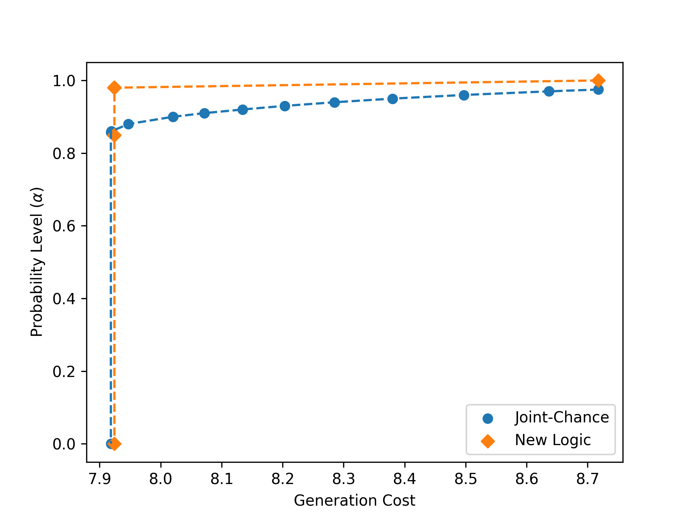

# Event-Constrained Optimal Power Flow
Here is the source-code for the stochastic optimal power flow case study that 
features different event constraints (e.g., joint chance constraints). The entirety 
of this case study is self-contained in `stochastic_optimal_powerflow.jl`. 



## Running it
To configure the required packages, we recommend creating a Julia environment 
using the included `Project.toml` file. Thus, we can configure the environment and 
run the case study via:
```julia
julia> cd("[INSERT_PATH_TO_FILES]/InfiniteDimensionalCases/CaseStudy1/")

julia> ]

(@v1.6) pkg> activate .

(CaseStudy1) pkg> instantiate

julia> include("stochastic_optimal_powerflow.jl")
```
Note it will be slow the first time it is run as the packages are installed 
and precompiled. However, subsequent runs should be relatively quick.
