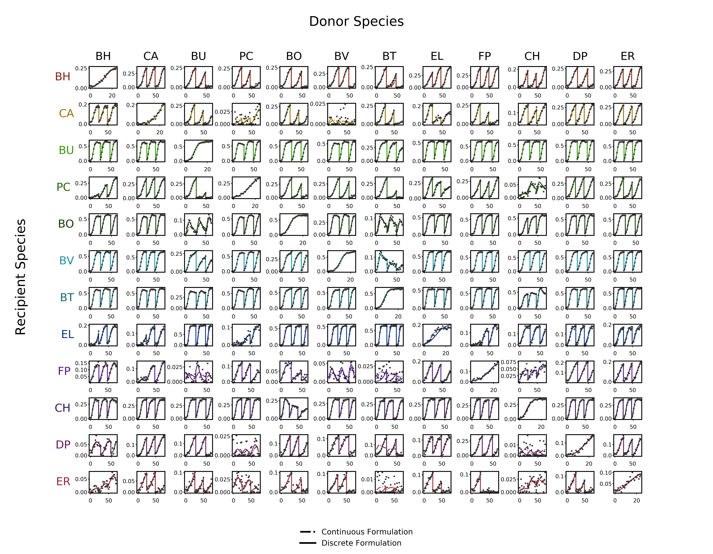

# Estimation in Dynamic Biological Systems
Here is the source-code for the dynamic biological community parameter estimation 
case study where we compare the utility of a formulation that uses the discrete 
experimental data directly and our proposed formulation that uses continuous fitted 
empirical functions of the experimental data. The file structure is as follows:
- `synthetic_data_generator.jl`: Simulates the system and generates the experimental data files.
- `sigmoidal_function_fitter.jl`: Fits a sigmoidal function to each experiment and stores fitted parameters via a data file.
- `continuous_estimation_problem.jl`: Implements the proposed continuous formulation and saves the results.
- `discrete_estimation_problem.jl`: Implements the traditional formulation and saves the results.
- `result_analyzer.jl`: Takes the above results and analyzes the accuracies.



## Running it
To configure the required packages, we recommend creating a Julia environment 
using the included `Project.toml` file. Thus, we can configure the environment and 
run the case study via:
```julia
julia> cd("[INSERT_PATH_TO_FILES]/InfiniteDimensionalCases/CaseStudy3/")

julia> ]

(@v1.6) pkg> activate .

(CaseStudy3) pkg> instantiate

julia> include("[DESIRED_SCRIPT_FILE]")
```
Note it will be slow the first time it is run as the packages are installed 
and precompiled. However, subsequent runs should be quicker. However, this 
particular case study is not well optimized code and is more much expensive to 
run in comparison to the other case studies.
