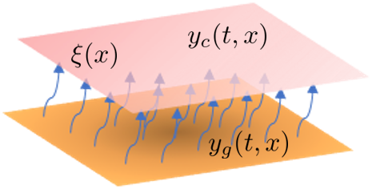

# Excursion Probability Optimization
Here is the source-code for the thermal diffusive system that is heated with 
spatially random diffusivity. Where we want to heat it to a setpoint but 
minimize the excursion past some threshold. The code is all contained in 
`diffusion.jl`.



## Setting up the solver
This uses the Gurobi commercial solver which must be installed before setting up 
the Julia dependencies. Alternatively, one can modify the project file to use 
Ipopt instead (though this will take significantly longer to solve).

## Running it
To configure the required packages, we recommend creating a Julia environment 
using the included `Project.toml` file. Thus, we can configure the environment and 
run the case study via:
```julia
julia> cd("[INSERT_PATH_TO_FILES]/RandomFieldOptCases/CaseStudy3/")

julia> ]

(@v1.6) pkg> activate .

(CaseStudy3) pkg> instantiate

julia> include("[DESIRED_SCRIPT_FILE]")
```
Note it will be slow the first time it is run as the packages are installed 
and precompiled. However, subsequent runs should be quicker. However, note this 
model is fairly challenging and takes a while to solve.
